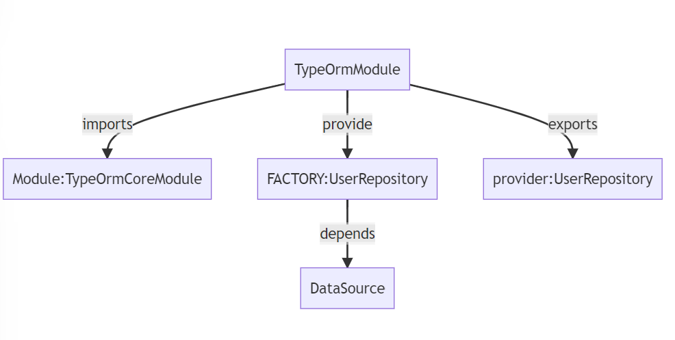

# 001 TypeORM Custom Repository Solution

## How to Do Custom Repository Using Typeorm With Nestjs?

This is how we create a custom repository in the past when using TypeORM with NestJS

```ts
import { EntityRepository, Repository } from 'typeorm';
import { Photo } from './photo.entity';

@EntityRepository(Photo)
export class CustomPhotoRepository extends Repository<Photo> {}
```

However, from the lastest version of TypeORM, EntityRepository is deprecated. So if you want to use custom repository, we need to find another way to create it.

## Solution

### Let's setup the example

```bash
npm install
# run database migration
npm run typeorm migration:run

# start app
npm run start:dev

# test
curl --location --request POST 'http://localhost:3000/create-user' \
--header 'Content-Type: application/json' \
--data-raw '{
    "firstName": "NestJS",
    "lastName": "Examples",
    "isActive": true
}'
```

### Let's figure out how @nestjs/typeorm works first.





```bash
npm install --save @nestjs/typeorm typeorm mysql2
```

Setup the connection with your database

```ts
// src/entities/User.ts
import { Entity, Column, PrimaryGeneratedColumn } from 'typeorm';

@Entity()
export class User {
  @PrimaryGeneratedColumn()
  id: number;

  @Column()
  firstName: string;

  @Column()
  lastName: string;

  @Column({ default: true })
  isActive: boolean;
}

// src/main.ts
import { Module } from '@nestjs/common';
import { TypeOrmModule } from '@nestjs/typeorm';
import { AppController } from './app.controller';
import { AppService } from './app.service';
import entities from './entities';
import { User } from './entities/User';
import { UserService } from './services/user-service';

@Module({
  imports: [
    TypeOrmModule.forRoot({
      type: 'mysql',
      host: 'localhost',
      port: 3306,
      username: 'root',
      password: '123456',
      database: 'nestjs_examples',
      entities: [User],
      synchronize: true,
    }),
    TypeOrmModule.forFeature(entities),
  ],
  controllers: [AppController],
  providers: [AppService, UserService],
})
export class AppModule {}

// src/services/user-service.ts
import { Injectable } from '@nestjs/common';
import { InjectRepository } from '@nestjs/typeorm';
import { instanceToInstance } from 'class-transformer';
import { UserDto } from 'src/dtos/user-dto';
import { User } from 'src/entities/User';
import { Repository } from 'typeorm';

@Injectable()
export class UserService {
  constructor(
    @InjectRepository(User) private readonly userRepository: Repository<User>,
  ) {}
  async createUser(userDto: Partial<UserDto>) {
    const userEntity = await this.userRepository.save(
      this.userRepository.create(userDto),
    );
    if (userEntity) {
      return instanceToInstance<UserDto>(userEntity);
    }
    return null;
  }
}
```
